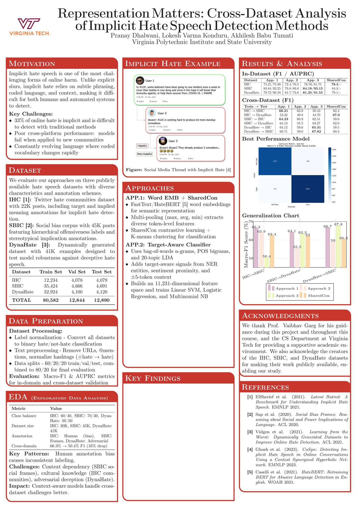

# Representation Matters

### Cross-Dataset Analysis of Implicit Hate Speech Detection Methods

> A controlled comparison of three representation strategies for detecting subtle, coded, and context-dependent hate speech across IHC, SBIC, and DynaHate.

  <a href="project-report.pdf"><strong>Read the full report</strong></a>
  &nbsp;&middot;&nbsp;
  <a href="research-poster.pdf"><strong>View the research poster</strong></a>

## Project overview

Implicit hate speech rarely relies on obvious slurs. It often appears through coded vocabulary, stereotypes, sarcasm, or hostile context, making it difficult for keyword systems—and even models trained on a single dataset—to identify reliably.

This Virginia Tech research project investigates a central question:

**How does the choice of text representation affect in-domain performance and transfer to an unseen hate-speech dataset?**

We evaluate three complementary approaches under a shared binary hate/not-hate setup:

1. **HateBERT + SharedCon** — contextual token embeddings with multi-pooling and supervised contrastive learning.
2. **Target-aware classifier** — TF-IDF word/character n-grams, POS bigrams, LDA topics, named entities, and sentiment proximity with classical ML classifiers.
3. **RoBERTa + FreeLB** — transformer fine-tuning with adversarial perturbations for improved robustness.

## Datasets

| Dataset | Focus | Train | Validation | Test |
|---|---|---:|---:|---:|
| IHC | Implicit hate, targets, and implied meaning | 12,234 | 4,078 | 4,079 |
| SBIC | Social bias, offensiveness, and stereotypical implications | 35,424 | 4,666 | 4,691 |
| DynaHate | Adversarially generated hate-speech examples | 32,924 | 4,100 | 4,120 |
| **Total** |  | **80,582** | **12,844** | **12,890** |

All datasets were normalized to binary classification. The common preprocessing pipeline removes URLs and user mentions, converts hashtags to plain text, and normalizes whitespace while preserving sentence context.

## Evaluation design

The study uses two complementary evaluation settings:

- **In-domain:** train and test on the same dataset.
- **Cross-dataset:** train on one dataset and test on another without target-domain fine-tuning.

We report **Macro-F1** to weight both classes equally and **AUPRC** to measure positive-class ranking quality under class imbalance.

## Results

### In-domain performance

Macro-F1 / AUPRC from the report:

| Dataset | HateBERT + SharedCon | Target-aware | RoBERTa + FreeLB |
|---|---:|---:|---:|
| IHC | 75.21 / 75.98 | 72.40 / 70.50 | **76.76 / 81.75** |
| SBIC | 83.84 / 92.25 | 79.80 / 89.00 | **84.18 / 93.15** |
| DynaHate | 79.72 / 90.58 | 61.70 / 73.60 | **81.35 / 91.55** |

### Cross-dataset generalization

Macro-F1 for the strongest configuration within each approach:

| Train → Test | HateBERT + SharedCon | Target-aware | RoBERTa + FreeLB |
|---|---:|---:|---:|
| IHC → SBIC | **66.31** | 63.90 | 50.43 |
| IHC → DynaHate | **53.32** | 49.80 | 44.70 |
| SBIC → IHC | **64.23** | 60.90 | 62.51 |
| SBIC → DynaHate | **64.13** | 55.50 | 63.27 |
| DynaHate → IHC | 64.12 | 59.60 | **65.31** |
| DynaHate → SBIC | 66.71 | 59.00 | **67.82** |

## Key findings

- Contextual transformer representations consistently outperform sparse linguistic features for in-domain detection.
- **RoBERTa + FreeLB** delivers the strongest overall in-domain results among the three implemented approaches, reaching **84.18 Macro-F1 and 93.15 AUPRC on SBIC**.
- Training on the diverse DynaHate data produces the best observed transfer result: **67.82 Macro-F1 on SBIC**.
- **HateBERT + SharedCon** remains highly competitive across dataset boundaries and leads four of the six transfer settings in this comparison.
- IHC-trained models transfer less reliably, illustrating how dataset scale, annotation choices, and platform-specific language shape generalization.
- Classical target-aware features are interpretable but degrade substantially on adversarial examples.

## Research artifacts

| Artifact | Description |
|---|---|
| [Full project report](project-report.pdf) | Methodology, architecture, experiments, ablations, error analysis, and references |
| [Research poster](research-poster.pdf) | A0 overview of the motivation, datasets, approaches, and principal results |

The supplied artifacts document the study and its results. Training code, datasets, model weights, and checkpoints are not included in this repository.

## Technology and methods

`Python` · `PyTorch` · `Transformers` · `HateBERT` · `RoBERTa` · `FastText` · `FreeLB` · `scikit-learn` · `spaCy` · `TF-IDF` · `LDA` · `K-means` · `Supervised Contrastive Learning`

## Team

- Pranay Dhalwani
- Lokesh Varma Konduru
- **Akhilesh Babu Tumati**

Virginia Polytechnic Institute and State University

We thank Prof. Vaibhav Garg for his guidance and acknowledge the creators of IHC, SBIC, and DynaHate for making their research datasets available.

## Responsible use

This repository discusses hate speech and may contain examples that are offensive or upsetting. They are included only for academic analysis. Automated moderation systems can reproduce annotation bias, miss cultural context, and disproportionately affect marginalized communities; model predictions should therefore support—not replace—careful human review.

## Citation

If you reference this project, please cite the repository metadata in [`CITATION.cff`](CITATION.cff).
